Generate a **Mermaid.js flowchart** from the given input, following these instructions:

1. Use the **process name** and **short process description** as the chart's title.
2. For the **process table**:
   - Convert each **Step** into a grouped section (`subgraph`) based on the **Responsible** column.
   - Within each section, represent activities (e.g., **Activity 1.1, 1.2** from the "Description" column) as individual nodes.
3. Connect activities sequentially within their respective groups.
4. For inter-group dependencies:
   - Use arrows (`->`) to represent transitions between groups when one group completes a step that starts another.
5. Annotate nodes with the **Description** text to provide context.
6. Highlight groups with distinct colors or styles to distinguish between responsible teams or departments.

---

### **Example Input:**

**Process Name:** Billing Pipeline

**Short Process Description:** Setting up billing pipeline for a company

**Process Table:**

| **Sr. No.** | **Description**                                                                                                                                                                                                                                             | **Responsible**                |
| ----------- | ----------------------------------------------------------------------------------------------------------------------------------------------------------------------------------------------------------------------------------------------------------- | ------------------------------ |
| 0.          | The billing process is initiated upon the completion of service delivery and the generation of an invoice. This trigger can be manual or automated, depending on the service type and billing cycle.                                                        |                                |
| **1.**      | **Activity 1.1:** The billing system generates an invoice based on the service details, pricing plans, and consumption data. **Activity 1.2:** The system validates the invoice for accuracy and completeness.                                              | Billing Team                   |
| **2.**      | **Activity 2.1:** The invoice is routed for approval to the designated approvers based on predefined rules. **Activity 2.2:** Approvers review the invoice for accuracy, compliance, and commercial terms.                                                  | Approvers (Finance/Sales)      |
| **3.**      | **Activity 3.1:** The approved invoice is issued to the customer through the preferred channel (email, portal, or physical mail). **Activity 3.2:** A copy of the invoice is archived for future reference and audit purposes.                              | Billing Team                   |
| **4.**      | **Activity 4.1:** The system monitors for payment receipts from customers. **Activity 4.2:** Payments are reconciled with the corresponding invoices. **Activity 4.3:** Any discrepancies or payment failures are flagged for investigation and resolution. | Accounts Receivable Team       |
| **5.**      | **Activity 5.1:** Revenue is recognized in the accounting system based on the timing of service delivery and payment terms. **Activity 5.2:** Revenue is allocated to the appropriate revenue accounts and cost centers.                                    | Accounting Team                |
| **6.**      | **Activity 6.1:** The system monitors for unpaid invoices and sends reminders to customers. **Activity 6.2:** Disputes or queries related to invoices are investigated and resolved.                                                                        | Customer Support, Billing Team |
| **7.**      | **Activity 7.1:** The system generates various reports on billing metrics, revenue trends, and customer payment behavior. **Activity 7.2:** Reports are analyzed to identify areas for improvement and optimization.                                        | Analytics Team                 |

---

### **Desired Output (Mermaid.js Syntax):**

```mermaid
graph TD
    %% Title
    title["Billing Pipeline: Setting up billing pipeline for a company"]

    %% Subgraphs for Groups (Responsible Teams)
    subgraph Billing_Team_1 [Billing Team]
        B1[Activity 1.1: Generate invoice based on service details, pricing plans, and consumption data]
        B2[Activity 1.2: Validate invoice for accuracy and completeness]
    end

    subgraph Approvers [Finance/Sales Approvers]
        A1[Activity 2.1: Route invoice for approval to designated approvers based on predefined rules]
        A2[Activity 2.2: Review invoice for accuracy, compliance, and commercial terms]
    end

    subgraph Billing_Team_2 [Billing Team]
        C1[Activity 3.1: Issue approved invoice to customer through preferred channel]
        C2[Activity 3.2: Archive invoice for future reference and audit purposes]
    end

    subgraph Accounts_Receivable_Team [Accounts Receivable Team]
        D1[Activity 4.1: Monitor payment receipts from customers]
        D2[Activity 4.2: Reconcile payments with corresponding invoices]
        D3[Activity 4.3: Flag discrepancies or payment failures for investigation]
    end

    subgraph Accounting_Team [Accounting Team]
        E1[Activity 5.1: Recognize revenue based on service delivery timing and payment terms]
        E2[Activity 5.2: Allocate revenue to appropriate revenue accounts and cost centers]
    end

    subgraph Customer_Support_Billing_Team [Customer Support, Billing Team]
        F1[Activity 6.1: Monitor unpaid invoices and send reminders to customers]
        F2[Activity 6.2: Investigate and resolve invoice disputes or queries]
    end

    subgraph Analytics_Team [Analytics Team]
        G1[Activity 7.1: Generate reports on billing metrics, revenue trends, and customer payment behavior]
        G2[Activity 7.2: Analyze reports to identify areas for improvement and optimization]
    end

    %% Connections
    B1 --> B2
    B2 --> A1
    A1 --> A2
    A2 --> C1
    C1 --> C2
    C2 --> D1
    D1 --> D2
    D2 --> D3
    D3 --> E1
    E1 --> E2
    E2 --> F1
    F1 --> F2
    F2 --> G1
    G1 --> G2

    %% Styling
    classDef group fill:#e2e2e2,stroke:#111,stroke-width:2px;
    class B1,B2,C1,C2,F1,F2 group;
    class A1,A2 group;
    class D1,D2,D3 group;
    class E1,E2 group;
    class G1,G2 group;

```

---

### Advanced Features:

1. Use **distinct subgraph styles** for better visual separation.
2. Automatically detect missing connections or implied dependencies (if any).
3. Include **legend** for node types for clarity.

So based on the above details create a similar flowchart for the below process

**Process Name:** [PROCESS NAME]

**Process Description:**

[PROCESS DESCRIPTION]

**Process Table:**
[PROCESS TABLE]
